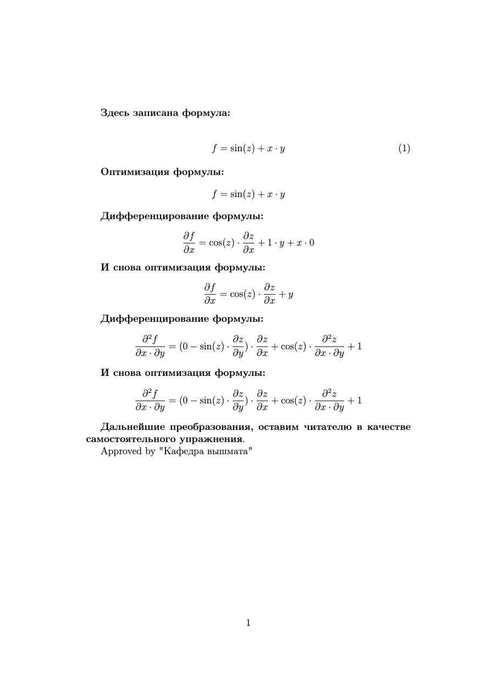
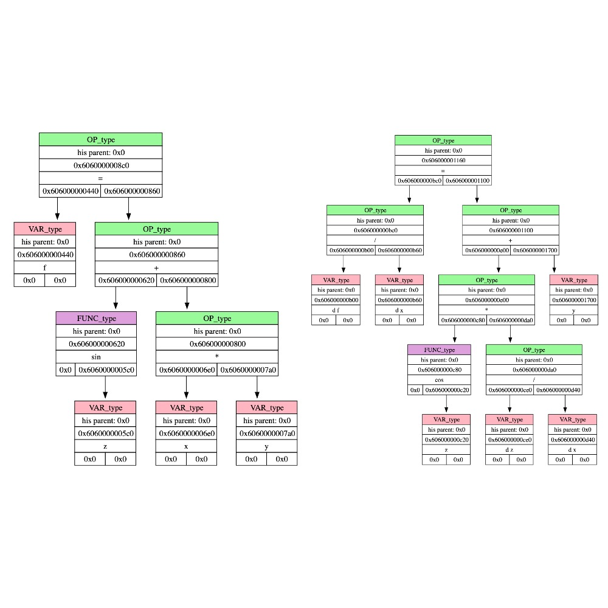
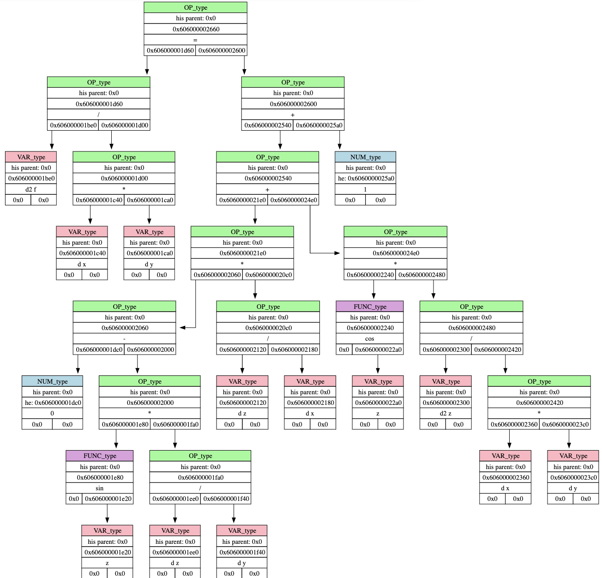

# Дифференциатор
Этот репозиторий содержит код, способный дифференцировать выражения, формулы с учетом аргумента, по которому ведется дифференцирование, и переменным, которые зависят от аргумента.

## Поддерживаемые платформы
- macOS
- Linux

## Установка
1. Перейдите на страницу [Releases](https://github.com/dmitrytjulkin/Differentiator/releases);
2. Скачайте файл;
3. Если хотите, чтобы файлом можно было воспользоваться в любом месте файловой системы, то поместите его в `/usr/local/bin`. Можно перенести файл в директорию, где он понадобится;
4. Дайте права на выполнение: `chmod +x /путь/к/файлу`.

## Пример использования
В терминал подается команда:
```
./differentiate input.txt
```


Получаем на выводе код, сгенерированный на языке LATEX и деревья выражений после каждого дифференцирования, как дополнительный способ проверить правильность кода:





## Использование
Программа считывает данные из файла, имя которого поступает в виде аргумента после команды `./differentiate`.

### Структура считываемого файла
Данные должны быть поделены на три предложения, отделенных друг от друга знаком `;` (знак перехода строки не считается концом предложения):
1. Первое предложение - формула или выражение;
2. Второе предложение - список переменных, которые зависят от аргументов дифференцирования;
3. Последнее предложение - список аргументов, в каком порядке будет происходить дифференцирование;
4. Программа поддерживает комментарии, которые должны обозначаться "//" в начале строки.

### Правила оформления считываемого файла
Переменные должны содержать не более 10 символов. Они могут содержать строчные латинские буквы, цифры и знак '_', однако переменная не может начинаться с цифры.

Первое предложение может состоять из переменных, функций, бинарных операций, чисел, знака '=' и круглых скобок.

Список бинарных операций:

| Название операции  | Её запись |
|--------------------|-----------|
| Плюс               | '+'       |
| Минус              | '-'       |
| Умножить           | '*'       |
| Делить             | '/'       |
| Возвести в степень | '^'       |

Список функций:
| Название функции      | Её запись |
|-----------------------|-----------|
| Квадратный корень     | "sqrt"   |
| Натуральный логарифм  | "ln"     |
| Синус                 | "sin"    |
| Косинус               | "cos"    |
| Тангенс               | "tg"     |
| Котангенс             | "ctg"    |
| Арксинус              | "arcsin" |
| Арккосинус            | "arccos" |
| Арктангенс            | "arctg"  |
| Арккотангенс          | "arcctg" |
